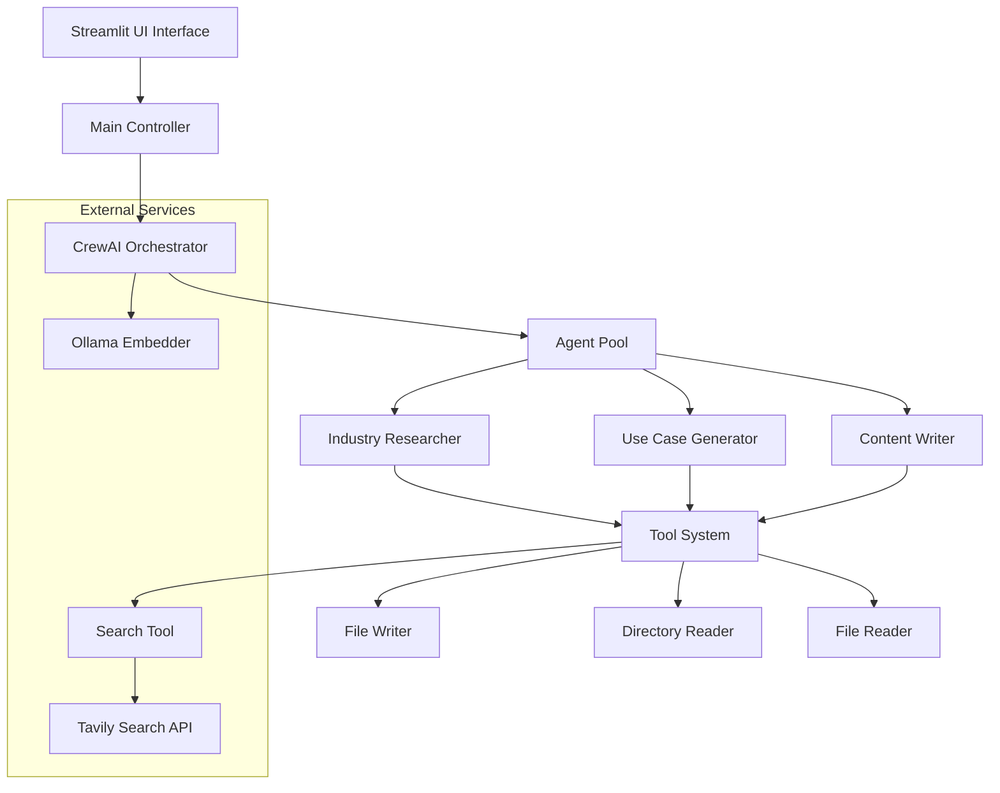
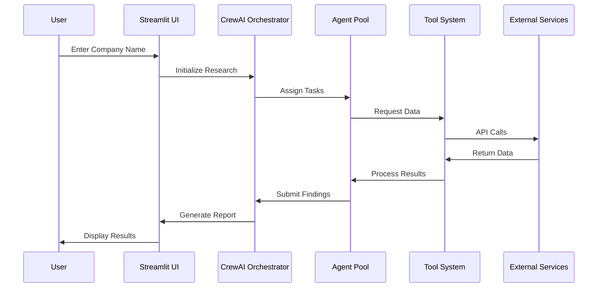
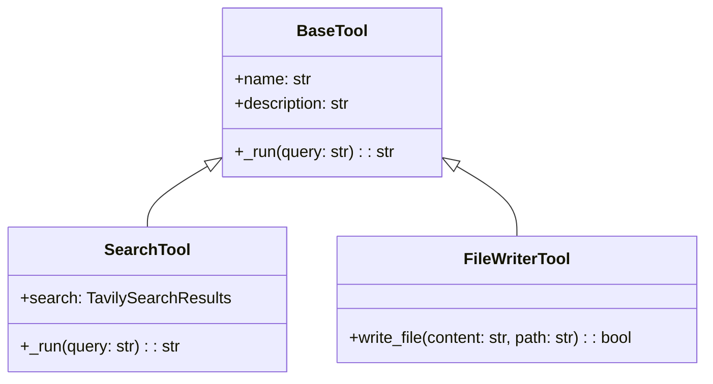
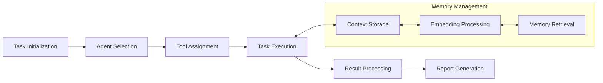
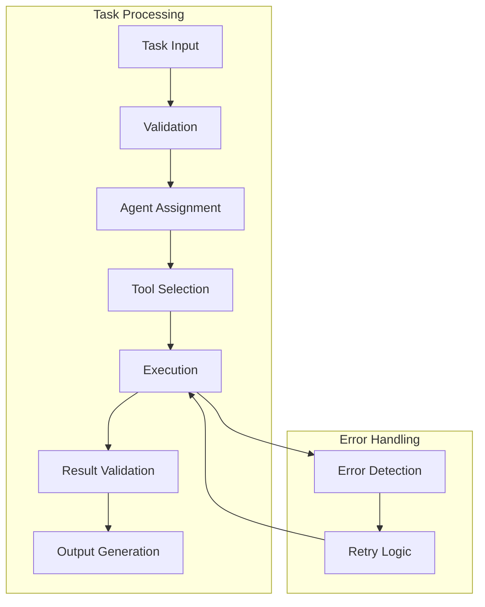
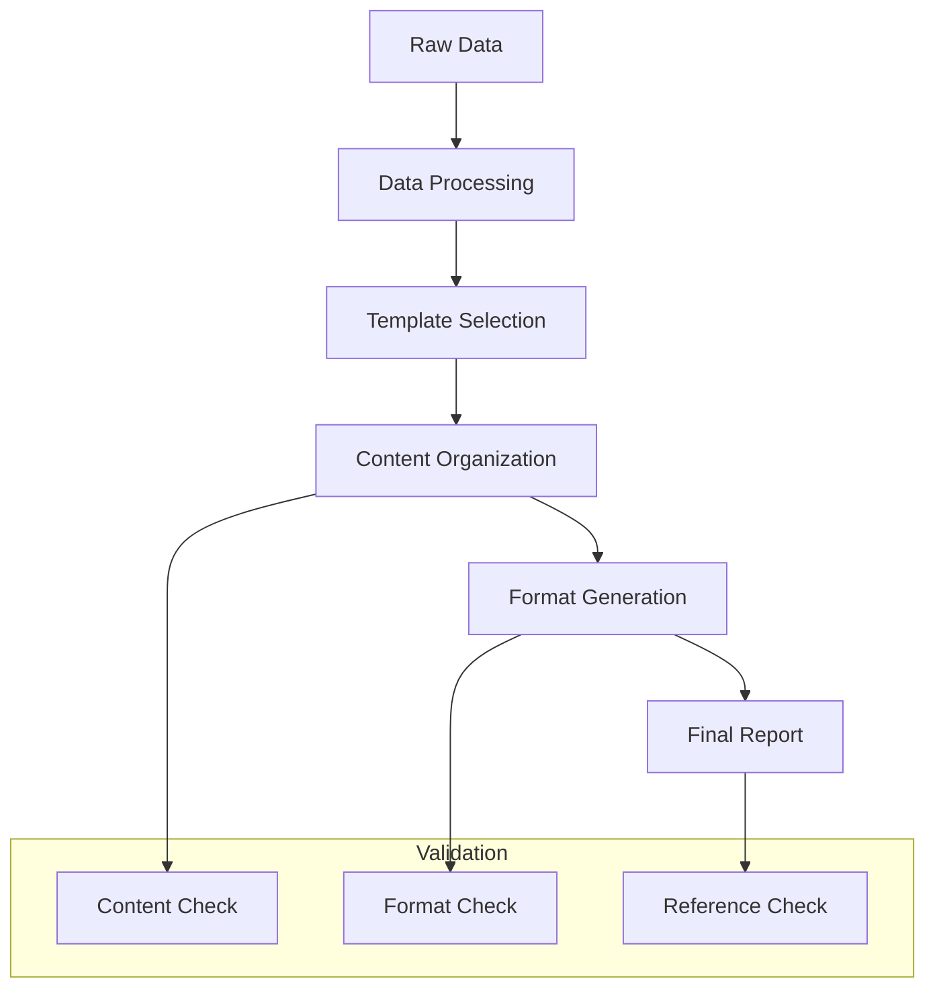
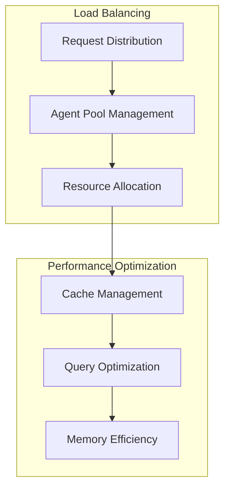

# Market Research AI - System Architecture Design Document

## 1. High-Level Design (HLD)

### 1.1 System Overview


### 1.2 Core Components

1. **Frontend Layer**
   - Streamlit Web Interface
   - User Input Processing
   - Report Display & Download

2. **Orchestration Layer**
   - CrewAI Controller
   - Task Scheduler
   - Memory Management
   - Embedding System

3. **Agent Layer**
   - Specialized AI Agents
   - Task Processing
   - Tool Integration

4. **Tool Layer**
   - Search Capabilities
   - File Operations
   - Data Processing

5. **External Services Layer**
   - API Integrations
   - Data Sources
   - Embedding Services

### 1.3 Data Flow


## 2. Low-Level Design (LLD)

### 2.1 Component Details

#### 2.1.1 Agent System Architecture
```python
class BaseAgent:
    - role: str
    - goal: str
    - backstory: str
    - tools: List[Tool]
    - verbose: bool
    - memory: bool
    - llm: str
    - allow_delegation: bool
```

#### 2.1.2 Tool System Design


### 2.2 Detailed Component Interactions

#### 2.2.1 Task Execution Flow


### 2.3 Technical Specifications

#### 2.3.1 Agent Configurations
```yaml
Industry Researcher:
  LLM: gpt-4o-mini
  Memory: Enabled
  Tools:
    - SearchTool
    - DirectoryReadTool
    - FileReadTool

AI Use Case Generator:
  LLM: gpt-4o-mini
  Memory: Enabled
  Tools:
    - SearchTool

Content Writer:
  LLM: gpt-4o-mini
  Memory: Enabled
  Tools:
    - FileWriterTool
```

#### 2.3.2 Task Processing Pipeline


### 2.4 Implementation Details

#### 2.4.1 Memory Management
```python
class MemorySystem:
    def store_context(context: Dict):
        # Store context in embedding space
        pass
    
    def retrieve_context(query: str):
        # Retrieve relevant context
        pass
    
    def update_memory(new_data: Dict):
        # Update existing memory
        pass
```

#### 2.4.2 Report Generation Process


### 2.5 Security Considerations

1. **API Security**
   - Key Management
   - Request Authentication
   - Rate Limiting

2. **Data Protection**
   - Input Validation
   - Output Sanitization
   - Secure Storage

3. **Error Handling**
   - Graceful Degradation
   - Error Logging
   - Recovery Mechanisms

### 2.6 Scalability Design



### 2.7 Monitoring and Logging

1. **System Metrics**
   - Agent Performance
   - Task Completion Rates
   - Error Frequencies

2. **Performance Tracking**
   - Response Times
   - Resource Usage
   - API Latency

## 3. Future Considerations

1. **Scalability Improvements**
   - Agent Pool Expansion
   - Tool Integration Framework
   - Memory Optimization

2. **Feature Enhancements**
   - Advanced Report Formats
   - Real-time Monitoring
   - Custom Agent Creation

3. **Integration Possibilities**
   - Additional Data Sources
   - Enhanced Search Capabilities
   - Advanced Visualization Tools
